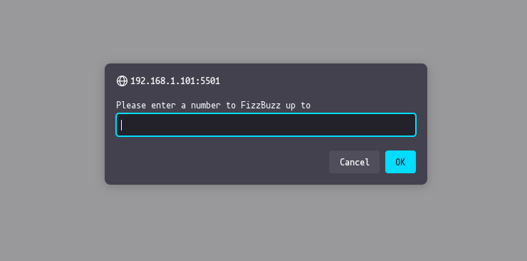
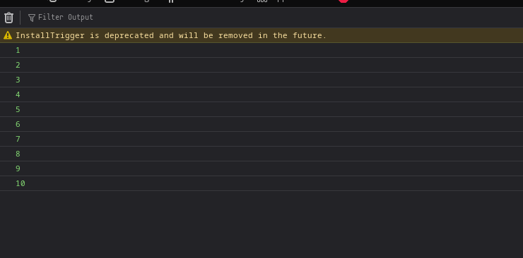
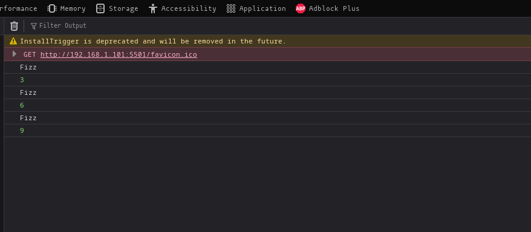
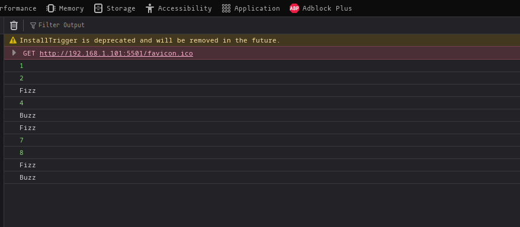
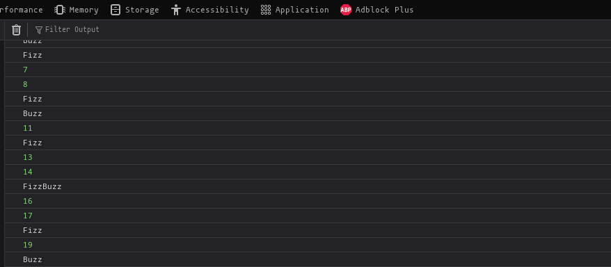

# The fizz buzz challenge

## Description

<p>The fizzbuzz challenge is a problem solving exercise taken from the Odin Project, it involves taking a childrens math problem called "FizzBuzz" used to teach basic math, and converting it to a programming problem to solve, it is an effective exercise to practice good problem solving approaches.</p>

## Why write it?

While the problem and solution here is pretty much the exact same and followed along the process of [The Odin Project](https://www.theodinproject.com/lessons/foundations-problem-solving), writing it down like this and lining up the process will allow the practice to stick, and provide a fallback point to the process should I ever get stuck in a problem solving situation.

## What is the Fizz Buzz Challenge?

The original concept of FizzBuzz can be read about **[here](https://en.wikipedia.org/wiki/Fizz_buzz)**

> <p>Fizz buzz is a group word game for children to teach them about division. Players take turns to count incrementally, replacing any number divisible by three with the word "fizz", and any number divisible by five with the word "buzz", and any number divisible by both three and five with the word "fizzbuzz" </p>
> [Wikipedia page on FizzBuzz](https://en.wikipedia.org/wiki/Fizz_buzz)

## The practice of problem solving

The exercise in portrayed in The Odin Project is not only to programming solution, but the process of problem solving leading to it.

In short, the problem solving process is described as:

<ol>
<li>Understanding the problem</li>
<li>Planning the solution</li>
<li>Break down the solution</li>
<li>divide and conquer</li>
</ol>

Lets do this!

## Understanding to problem

Understanding the problem involves getting a overview of the problem, in order to start breaking down what's needed to solve it in broad strokes.

#### The problem:

Quoted from [TheOdinProject](https://www.theodinproject.com/lessons/foundations-problem-solving)

> <p>Write a program that takes a user’s input and prints the numbers from one to the number the user entered. However, for multiples of three print Fizz instead of the number and for the multiples of five print Buzz. For numbers which are multiples of both three and five print FizzBuzz.</p>

This step also involves potentially rewriting the problem received to achieve a greater understanding.

> <p>Write a program that takes a user's input and prints the number from one, to the number the user entered, but replace each number divisable by 3 without a remained, with the word "Fizz", each number divisable by 5, without a remainder with the word "Buzz" and each word divisable by both 3 and 5 without a remainder, with the number "FizzBuzz"</p>

## Planning to solution

In order to form an initial idea towards a solution, asking the right questions, mapping out a solution, making mindmaps or sketching out ideas can all lead towards a solution. This is where we release all the ideas and put it on paper.

Ask the following questions to start, more relevant questions may form depending on the problem, but examples to start out with could be:

> <p>Does your program have a user interface? What will it look like? What functionality will the interface have? Sketch this out on paper.</p>

<p>No, the program will function fine in the form of a browser console program.</p>

> <p>What inputs will your program have? Will the user enter data or will you get input from somewhere else?</p>

<p> The user will be prompted to enter a number that the program will itterate towards</p>

> <p>What’s the desired output?</p>

<p>The desired output will be a list of numbers from 1 to the input of the user, where each number divisible by 3 is renamed Fizz, each number divisible by 5 is renamed Buzz, and each number divisible by both 3 and 5 is renamed FizzBuzz</p>

> <p>Given your inputs, what are the steps necessary to return the desired output?</p>

## Break down the solution

In order to break down the solution, we will use psuedocode to create a outline of a program, forming a timeline of events that will create the initial draft of the solution.

```
User inputs a number in a prompt
A for loop itterates through the numbers 1 to the users input
If the current number is divisible by 3, then print "Fizz"
If the current number is divisible by 5, then print "Buzz"
If the current number is divisible by 3 and 5, then print "FizzBuzz"
Otherwise, print the current number.
```

With the inital draft of the solution established, we can now proceed to...

# Divide and conquer

As we divide the psuedocode into small pieces, e.g

> <p>"User inputs a number in a prompt"</p>

<p>we start having a much more approachable process to follow in order to reach a solution. 
Having now divided the big over-arching problem into smaller sub-problems, we can now start <b>implementing the smaller sub-solutions</b></p>

### Implement the solution

Starting from the top of our psuedocode:

## Step 1. User inputs a number in a prompt

Lets solve this issue first and forget the rest for now:

> <p>Create a variable called answer, create a prompt, asking the player to provide a number, the prompt is wrapped in a parseInt to ensure the number provided is returned as a integer </p>

```js
let answer = parseInt(prompt("Please enter a number to FizzBuzz up to"))
```

## Alright! We got a window prompt when the page loads!



## Step 2. A for loop itterates through the numbers 1 to the users input

Again, focus on one sub-problem at a time:

> <p>For loop that itterates from a variable i, declared as 1, if the itteration is less than or equal to the answer that we got above, itterate by 1. Should the user input 10 for instance, the program will itterate this loop until 10 is reached.</p>

```js
for (let i = 1; i <= answer; i++) {
  console.log(i)
}
```

### We be itterating now! Console log itterating from 1 to with 10 as input



## Step 3. If the current number is divisible by 3, then print "Fizz"

> <p>An if check will serve to check the condition, of wether the number is divisible by 3, if true, the number will print as "Fizz" instead.</p>

```js
if (i % 3 === 0) {
  /*If true, print "Fizz" */
  console.log("Fizz")

  /* If false, print itteration */
  console.log(i)
}
```

### Now the program is starting to take shape! Look at her go!



## Step 4. If the current number is divisible by 3, then print "Buzz"

Alright, simple enough, lets add an else if statement to the checklist.

```js
if (i % 3 === 0) {
  /*If true, print "Fizz" */
  console.log("Fizz")
} else if (i % 5 === 0) {
  /* Else if true, print "Buzz" */
  console.log("Buzz")
} else {
  /* If false, print itteration */
  console.log(i)
}
```

### We be buzzing now!



## Step 5. If the current number is divisible by 3 and 5, then print "FizzBuzz"

Once more! This time though, we must move things around. We should check if the itteration is divisible by 3 AND 5 first, then proceed, as otherwise the singular check statements Fizz and Buzz will trigger before FizzBuzz ever has a chance to check!

```js
if (i % 3 === 0 && i % 5 === 0) {
  /*If both are true, print FizzBuzz*/
  console.log("FizzBuzz")
} else if (i % 3 === 0) {
  /*If true, print "Fizz" */
  console.log("Fizz")
} else if (i % 5 === 0) {
  /* Else if true, print "Buzz" */
  console.log("Buzz")
} else {
  /* If false, print itteration */
  console.log(i)
}
```

### It's working!



## Step 6. Otherwise, print the current number

We already did this, remember?

```js
        else {
          /* If false, print itteration */
          console.log(i)
        }
```

### This simply prints any other number that is not fizz, buzz or fizzbuzz!

# We did it!

By using a solid problem solving routing we managed understand a problem, break it down, plan it out, divide and conquer and finally implement the solution!

### Try it out!

The whole program was just cramped into a script tag of the index page of this project, check it out [here](danishkodemonkey.github.io/fizzbuzzchallenge)
and see the full solution with commentation on the index.html of the repo

## Thank you!

Again, thanks to [The Odin Project](https://www.theodinproject.com/) for creating a great curriculum that not only covers the path towards full stack through the different languages, but also helps build solid and helpful skills that will help in the real world.
